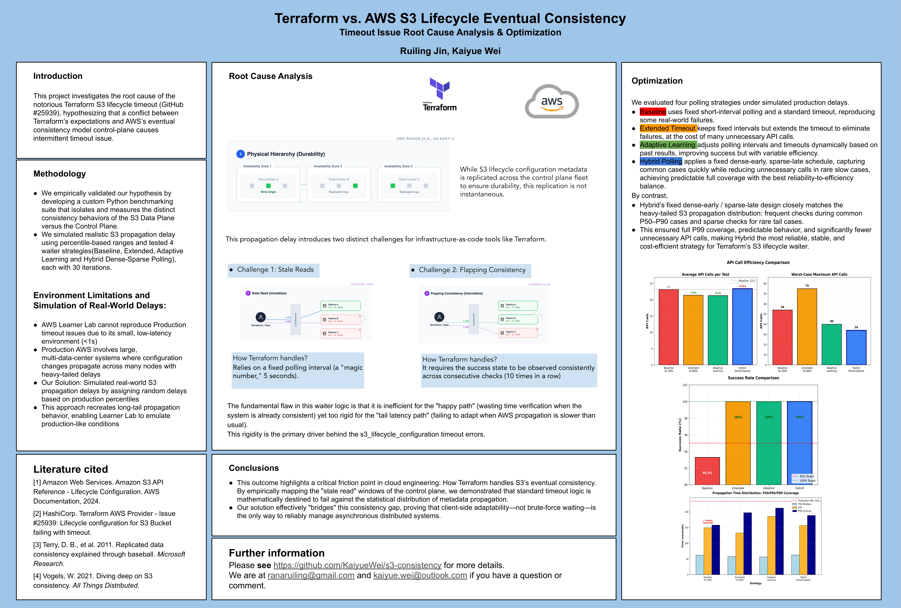

# Terraform vs. AWS S3 Lifecycle Eventual Consistency

**Root cause analysis and waiter optimization for [hashicorp/terraform-provider-aws#25939](https://github.com/hashicorp/terraform-provider-aws/issues/25939)**

Applying an S3 lifecycle configuration through Terraform intermittently fails with
`timeout while waiting for state to become 'READY' (last state: 'NOT_READY', timeout: 3m0s)`.
The write succeeds; the read-back does not converge in time. This project tests the
hypothesis that the cause is a mismatch between the S3 **control plane's** eventual
consistency and Terraform's **fixed-interval waiter**: the control plane's propagation
delay is heavy-tailed, while the waiter polls on a fixed schedule against a fixed 180s
deadline. We built a Python benchmarking harness to measure S3's two consistency models
directly, then compared four polling strategies against a simulated production delay
distribution. A hybrid dense-early / sparse-late schedule reached 100% success with the
lowest worst-case API cost.

Course project for Northeastern **CS6620** (Cloud Computing).

---

## Poster

**→ [Read the poster as a PDF](docs/poster.pdf)** (the PNG below is unreadable at GitHub's
column width — open the PDF or the raw PNG to zoom.)



---

## The problem

S3 exposes two different consistency models, and the difference is the whole story:

| | Scope | Consistency |
|---|---|---|
| **Data plane** | Objects (`PutObject`, `GetObject`) | Strong. Read-after-write is immediate. |
| **Control plane** | Bucket configuration (lifecycle rules, policies) | Eventual. Metadata is replicated across the control plane fleet asynchronously. |

Terraform's `aws_s3_bucket_lifecycle_configuration` resource issues a control plane write,
then polls the control plane to confirm the new rules are visible. That polling loop runs
into two distinct failure modes.

**Challenge 1 — stale reads.** Immediately after the `PUT`, a `GET` may be routed to a
replica that has not received the update and returns the *previous* configuration. The
client has to choose between sleeping longer (high latency on every apply) or polling
harder (high API load). Terraform picks a fixed polling interval — a magic number, ~5
seconds.

**Challenge 2 — flapping consistency.** A single successful read is not proof of
convergence. The next request may land on a different, lagging replica, and the observed
state flaps between configured and unconfigured. Terraform mitigates this with a stability
check: it does not accept one success, it requires the success state to be observed across
**10 consecutive checks**.

Together these make the waiter wrong at both ends of the distribution:

- **Wasteful on the happy path.** When propagation has already completed, the waiter still
  spends 10 more polls — roughly 50 seconds of fixed-interval verification — confirming
  something that is already true.
- **Too rigid on the tail.** The interval never adapts and the 180s deadline never moves.
  Propagation slower than the deadline is not merely slow, it is a hard failure. Against a
  heavy-tailed distribution, a fixed cutoff is statistically guaranteed to fail some
  fraction of applies. That rigidity is the primary driver of the `#25939` timeouts.

---

## Methodology

Two stages: measure what the lab actually does, then simulate what production does.

### Stage 1 — measure the two consistency models

`verification/` runs a benchmark suite against real S3 in `us-west-2`, in both a sequential
and a concurrent ("racer") configuration, 100 iterations each. The racer test starts a
poller *before* the lifecycle write lands, so it captures the propagation window rather
than measuring after the fact.

| Test | N | Success | Result |
|---|---|---|---|
| Data plane, sequential | 100 | 100% | Mean 99.3 ms, median 99.0 ms, P99 225.7 ms |
| Data plane, concurrent (100 parallel writes) | 100 | 100% | Total mean 302.4 ms, P99 414.5 ms |
| Control plane, sequential | 100 | 100% | Mean 0.07 s, median 0.05 s, max 1.09 s. Visible in <1 s: 98.0%. **Stale first read: 2.0%** |
| Control plane, concurrent racer | 100 | 100% | Mean 1.85 s, median 0.97 s, P95 5.57 s, P99 11.56 s, **max 11.83 s**. Visible in <1 s: 52.0%. 8 events >5 s |

Two things fall out. First, the data plane never failed a read-after-write in 200 attempts
— strong consistency holds, and the bug is not there. Second, the control plane *does*
show the predicted behaviour: 2% of first reads returned the previous configuration
(stale reads, confirmed), and under concurrency the propagation distribution stretches from
a 0.97 s median to an 11.83 s worst case — a tail an order of magnitude past the median.

### Stage 2 — the lab-vs-production gap, and how we closed it

**These delays are simulated, not measured in production. This is the main limitation of
the project and it is worth being blunt about it.**

AWS Learner Lab is a small, low-latency environment. Control plane changes propagate in
under a second (98% of the time in our sequential test), so the lab **cannot reproduce the
#25939 timeout at all** — nothing there ever approaches 180 seconds. Production S3 is a
much larger, multi-data-center system where configuration changes cross many nodes and the
delay distribution is heavy-tailed.

So we injected synthetic delays drawn from the production percentiles reported in the
upstream issue, and evaluated the strategies against those. The shape of the tail is
reproduced; the numbers are not our own measurements of production.

Delay distribution used by the simulator (`waiter_strategies/simulated_waiter.py`):

| Percentile | Propagation time | Meaning |
|---|---|---|
| P50 | 48 s | Half of requests propagate within 48 s |
| P75 | 82 s | |
| P85 | 120 s | |
| P90 | 142 s | |
| P95 | 156 s | |
| P99 | 234 s | **Past Terraform's 180 s deadline** |
| Max | 312 s | Worst case observed |

Terraform's 180 s timeout sits between P95 and P99. It covers the ordinary case and misses
the tail — the failure is structural, not a tuning accident.

Mechanism: each test draws one delay from that distribution. Until the delay has elapsed,
the poller's checks return `False`; after it elapses, the check performs a real
`GetBucketLifecycleConfiguration` against S3. Every strategy runs **30 iterations** and
records, per iteration, success/failure, wall-clock propagation time, check count, API
calls, and a full per-attempt polling history.

---

## The four strategies

All four subclass a shared framework (`BaseWaiterStrategy`) and differ only in two methods:
`calculate_next_interval(elapsed, check_count)` and `should_timeout(elapsed, check_count)`.

**1. Baseline — `Baseline-3s-180s`.** Fixed 3 s polling interval, 180 s timeout. Stands in
for current provider behaviour and establishes the comparison point. It is the only
strategy whose deadline falls short of the simulated P99, and the only one that fails.

**2. Extended Timeout — `Extended-3s-600s`.** Identical fixed 3 s interval, timeout raised
to 600 s. Tests whether simply waiting longer is enough. It is: failures go to zero. But
the interval is unchanged, so a slow propagation is polled at the same density for ten
minutes, and the worst case becomes the most expensive of any strategy.

**3. Adaptive Learning — `Adaptive-Learning-v2`.** Learns its deadline from history. For
the first 3 tests it uses a floor of 300 s; after that the timeout is `mean + 3×stdev` of
the last 20 successful propagation times, clamped to [300 s, 600 s]. Its polling interval
is a fixed tiered schedule: 2 s below 30 s elapsed, 4 s to 60 s, 8 s to 120 s, 10 s to
180 s, then 15 s. It reaches full success, but the learned deadline depends on a warm-up
period and on whatever the recent sample happened to contain.

**4. Hybrid Dense-Sparse — `Hybrid-Dense-Sparse`.** A fixed dense-early / sparse-late
schedule with a 600 s timeout, inspired by Dean & Barroso's hedging work. Interval by
elapsed time: **2 s under 30 s, 4 s from 30–60 s, 8 s from 60–120 s, 15 s beyond 120 s.**
No learning, no state — the schedule is a constant.

| Strategy | Interval | Timeout | Adaptive? |
|---|---|---|---|
| Baseline | 3 s fixed | 180 s | No |
| Extended | 3 s fixed | 600 s | No |
| Adaptive Learning | 2 / 4 / 8 / 10 / 15 s tiered | 300–600 s, learned | Timeout only |
| Hybrid Dense-Sparse | 2 / 4 / 8 / 15 s tiered | 600 s | No |

---

## Results

30 iterations per strategy, against the simulated distribution above.

| Strategy | Success rate | Avg API calls / test | Worst-case API calls |
|---|---|---|---|
| Baseline `3s-180s` | **93.3%** | 23.2 (baseline) | 54 |
| Extended `3s-600s` | 100% | −7.8% | **75** |
| Adaptive Learning | 100% | −8.2% | 40 |
| **Hybrid Dense-Sparse** | **100%** | +0.9% | **34** |

**Baseline fails.** 93.3% success — it cannot reach the simulated P99 of 234 s, because its
deadline is 180 s. The failures are not noise; they are the tail arriving on schedule.

**Extended fixes reliability by brute force.** 100% success, but its worst case costs 75 API
calls — more than the Baseline it replaces. Polling every 3 s for up to 600 s means a slow
propagation is interrogated ~200 times in the limit. Longer waiting alone is not an answer.

**Adaptive learns, at the cost of predictability.** 100% success and a good worst case (40
calls), but its deadline is only as good as its warm-up window, and its behaviour on any
given apply depends on recent history.

**Hybrid wins, and the reason is distributional.** Its fixed schedule is shaped like the
propagation distribution itself. Most propagations complete in the P50–P90 band, so it
polls densely (2 s) exactly where the probability mass is and catches the common case
almost immediately. Rare tail propagations get sparse 15 s checks — enough to reach the
full P99 without paying for the wait. The result is full P99 coverage at the **lowest
worst-case API cost of any strategy (34 calls, 37% below Baseline's 54 and 55% below
Extended's 75)**, with a schedule that is fixed and therefore predictable: no warm-up, no
state, no dependence on what the last 20 applies happened to look like.

One honest caveat on that table: Hybrid's win is in the **tail**, not the average. Its
average API calls per test are +0.9% versus Baseline — essentially tied, and slightly worse
than Extended and Adaptive — because dense 2 s early polling costs extra calls in the common
fast case. What it buys with those calls is 100% success and the cheapest worst case. If
you care about the P99 apply, Hybrid is the best trade; if you only cared about mean API
volume, Adaptive is marginally cheaper.

---

## Repository structure

```
waiter_strategies/          # Polling strategy implementations (Ruiling Jin)
├── base_waiter.py          # BaseWaiterStrategy ABC: test loop, metrics, percentile analysis
├── simulated_waiter.py     # SimulatedBaseWaiterStrategy: injects the delay distribution
├── strategy_baseline.py    # Baseline-3s-180s
├── strategy_extended.py    # Extended-3s-600s
├── strategy_adaptive.py    # Adaptive-Learning-v2
└── strategy_hybrid.py      # Hybrid-Dense-Sparse

verification/               # Consistency measurement against real S3 (Kaiyue Wei)
├── test/
│   ├── test_s3_consistency/                # Sequential data-plane + control-plane tests
│   │   ├── test_s3_consistency.py
│   │   ├── data_plane_results.csv          # N=100
│   │   ├── control_plane_results.csv       # N=100
│   │   └── log.txt
│   └── test_s3_consistency_concurrent/     # Concurrent "thundering herd" + racer tests
│       ├── test_s3_consistency_concurrent.py
│       ├── data_plane_concurrent_results.csv
│       ├── control_plane_racer_results.csv # N=100, with per-iteration API call counts
│       └── concurrent_log.txt
└── analysis/
    ├── analyze_results.py                  # Aggregates the CSVs, emits report + plots
    ├── analysis_report.txt                 # The numbers in the Stage 1 table above
    ├── data_plane_latency.png
    ├── control_plane_propagation.png
    ├── control_plane_cdf.png
    └── control_plane_api_calls.png

docs/
├── poster.pdf              # Conference poster
└── poster.png
```

### Running it

Each strategy is a standalone script taking a bucket name. Imports are flat, so run from
inside the directory:

```bash
cd waiter_strategies
python strategy_hybrid.py my-test-bucket     # 30 iterations, simulation on by default
```

Requires `boto3`, `numpy` and configured AWS credentials. The verification suite
additionally needs `pandas` and `matplotlib`, creates and deletes its own bucket, and
defaults to `us-west-2` (override with `AWS_REGION`).

```bash
cd verification/test/test_s3_consistency && python test_s3_consistency.py
cd verification/analysis && python analyze_results.py
```

Note that a full strategy run is dominated by real sleeping — 30 iterations against a
distribution with a 48 s median takes well over half an hour.

---

## Limitations, and what I would do differently

- **The delays are simulated, not measured.** This is the big one. The percentile
  distribution comes from the upstream issue, not from our own production observation. We
  reproduced the *shape* of the tail. A real validation would require running against
  production-scale S3 over a long enough window to observe genuine P99 events.
- **30 iterations per strategy.** At n=30, a 93.3% success rate means exactly two failures.
  That is enough to demonstrate that a 180 s deadline is structurally short, and not enough
  to give tight confidence intervals on any of the reported rates. The 100% figures should
  be read as "no failures in 30 runs," not as a measured reliability.
- **Single region, single account, one lab environment.** Everything ran in `us-west-2` on
  AWS Learner Lab. Propagation behaviour may differ by region, account size, and load.
- **The strategies don't implement Terraform's stability check.** Our waiters accept the
  first successful read. The real provider requires 10 consecutive successes, which adds
  API calls and wall-clock time on every apply. Modelling that would change the absolute
  API call counts, though not the relative ordering of the strategies.
- **Results are reported, not committed.** `save_results()` writes per-strategy JSON, but
  those files aren't in the repository — the numbers in the Results table come from the
  poster and slides. Committing the raw runs would make the analysis reproducible.
- **Hybrid's tiers are hand-tuned to this distribution.** The 2/4/8/15 s breakpoints were
  chosen to match a distribution we already knew. Fitting the schedule to the distribution
  it is tested against is a real form of overfitting; the interesting next step is deriving
  the schedule from the observed distribution online, and testing it against a distribution
  it hasn't seen.
- **Not an upstream fix.** This is course research, not a merged provider change. No patch
  was submitted to `terraform-provider-aws`.

---

## Team and attribution

Joint course project for Northeastern **CS6620**, with **Kaiyue Wei**.
Original team repository: **https://github.com/KaiyueWei/s3-consistency**

**My contribution (Ruiling Jin) — the waiter strategies and the framework they share
(`waiter_strategies/`):**

- **`base_waiter.py`** — the `BaseWaiterStrategy` abstract base class the other five files
  are built on. It defines the strategy contract as two abstract methods
  (`calculate_next_interval`, `should_timeout`), so a new polling policy is expressible in
  a few lines, and implements everything else once: the PUT/poll test loop, unique
  per-iteration lifecycle configuration generation, configuration matching against
  `GetBucketLifecycleConfiguration`, per-attempt polling history, API call accounting, the
  30-iteration suite runner, percentile analysis (P50/P75/P90/P95/P99, mean, stdev) of
  propagation time and API calls, theoretical coverage analysis against the #25939
  distribution, and JSON result serialization.
- **`simulated_waiter.py`** — the delay injection layer. `SimulatedBaseWaiterStrategy`
  overrides `check_configuration_match` to draw a propagation delay from the seven-bucket
  percentile distribution and suppress success until that delay elapses, then fall through
  to a real S3 call. This is what makes the Learner Lab able to exercise tail behaviour it
  can't produce on its own, and it's toggleable (`enable_simulation=False`) to run the same
  strategies against unmodified AWS.
- **The four strategies** — `strategy_baseline.py`, `strategy_extended.py`,
  `strategy_adaptive.py`, `strategy_hybrid.py`: the tiered interval schedules, the adaptive
  `mean + 3×stdev` timeout model with bootstrap and clamping, and the Hybrid dense-sparse
  design that produced the best reliability-to-cost result.

Kaiyue Wei built the `verification/` consistency measurement suite and the analysis
pipeline.

---

## References

1. Amazon Web Services. *Amazon S3 API Reference — Lifecycle Configuration.* AWS Documentation, 2024.
2. HashiCorp. *Terraform AWS Provider — Issue #25939: Lifecycle configuration for S3 Bucket failing with timeout.*
3. Terry, D. B., et al. *Replicated data consistency explained through baseball.* Microsoft Research, 2011.
4. Vogels, W. *Diving deep on S3 consistency.* All Things Distributed, 2021.
